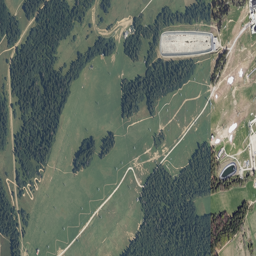
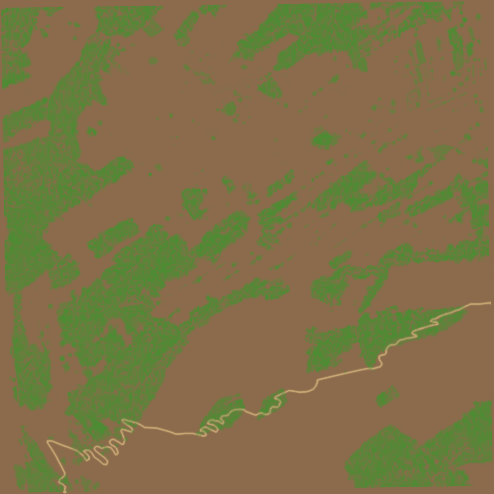
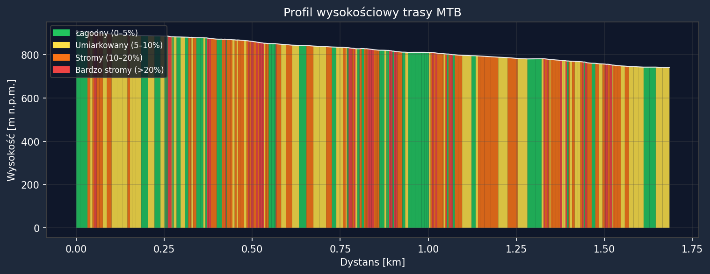

# MTB Trail Reconstruction

[](https://github.com/Cytryniusz/mtb-trail-reconstruction/actions/workflows/ci.yml)

End-to-end pipeline that turns public LiDAR + GPS + aerial imagery into a photorealistic, Unity-ready 3D scene of a mountain bike trail.

> Engineering thesis (Praca inzynierska, 2026). Polish source documentation lives in [`README.pl.md`](README.pl.md).

<p align="center">
  
  
  
</p>

## What this project does

Given:

- a raw LiDAR point cloud (`.laz`/`.las`, e.g. from GUGiK in Poland),
- a GPS track of a ride (`.gpx` from a bike computer or smartphone), and
- one or more orthophoto tiles (`.tif` GeoTIFF),

it produces:

- a cleaned, classified, decimated terrain mesh in four LOD levels (Unity-ready `.obj`/`.ply`),
- a power-of-two orthophoto texture, georeferenced to the mesh,
- a textured LOD0 mesh (`.obj` + `.mtl`) with planar UV mapping baked from the orthophoto, ready to drop into Unity,
- a 4-channel terrain splatmap (ground / path / undergrowth / rock) for Unity Terrain Layers,
- an elevation profile coloured by slope class,
- structured JSON reports for the thesis chapter on experiments.

## Pipeline at a glance

```
   raw .laz                raw .gpx                raw .tif (xN)
       |                       |                          |
   [01] cleanup              [03] reproject WGS84      [06] mosaic + crop
   SOR + ROR                 -> EPSG:2180                 + resize 2^N
       |                       |                          |
   [02] extract ground       processed/*.gpkg          results/ortho/ortho.png
   (ASPRS class 2)              |
       |                       |
       +-----------+-----------+
                   |
              [04] integrate GPS x LiDAR
              (Delaunay 2.5D mesh, crop to buffer)
                   |
              [05] cleanup mesh + cascade LOD
              (Taubin smoothing, Quadric decimation)
                   |
                   v
              results/lod/mesh_LOD{0..3}_unity.{ply,obj}
                                  |
              [08] apply texture (planar UV: LOD0 mesh x ortho.png)
                                  |
              results/textured/mesh_LOD0_unity_textured.obj (+ .mtl)
                                  +
              [07] splatmap RGBA  -> results/splatmap/splatmap.png
                                  +
                                Unity URP scene
```

See [`docs/pipeline.md`](docs/pipeline.md) for the detailed diagram and rationale.

## Quick start

```bash
# 1. Clone
git clone https://github.com/<your-username>/mtb-trail-reconstruction.git
cd mtb-trail-reconstruction

# 2. Environment (conda recommended -- PDAL needs the conda-forge binary)
conda env create -f environment.yml
conda activate mtb-trail

# 3. Drop your data in
#    See data/README.md for download instructions
cp /path/to/your.laz data/lidar/
cp /path/to/your.gpx data/gps_trace/
cp /path/to/your_ortho.tif data/ortho/

# 4. Run the whole pipeline
python scripts/run_all.py \
    --laz data/lidar/your.laz \
    --gpx data/gps_trace/your.gpx \
    --ortho-tifs data/ortho/your_ortho.tif

# Or step by step (see scripts/0X_*.py)
python scripts/01_clean_lidar.py --input data/lidar/your.laz
python scripts/02_extract_ground.py --input processed/your_filtered.laz
...
```

## Repository layout

```
mtb-trail-reconstruction/
|-- src/mtb_terrain/         Reusable library code (importable package)
|   |-- lidar/               Cleanup, SMRF classification, ground extraction
|   |-- gps/                 GPX parsing + reprojection to EPSG:2180
|   |-- mesh/                Delaunay 2.5D + Poisson, cleanup, LOD cascade
|   |-- ortho/               Orthophoto mosaic + crop + Unity-ready resize
|   |-- texture/             Planar UV projection of the ortho onto the LOD0 mesh
|   |-- splatmap/            4-channel terrain splatmap generation
|   `-- viz/                 Slope-coloured profiles and visualisation helpers
|-- scripts/                 Thin CLI wrappers (01_..08_ + run_all.py)
|-- configs/default.yaml     Reference configuration (CRS, filters, LOD targets)
|-- data/                    (gitignored) raw inputs -- see data/README.md
|-- processed/               (gitignored) intermediate artefacts
|-- results/                 (gitignored) final outputs (meshes, textures, reports)
|-- examples/sample_results/ Small PNGs shown in this README
|-- docs/                    Pipeline doc, data sources, screenshots
`-- MIGRATION.md             How to publish this repo to GitHub
```

## Technology stack

| Domain       | Tool                                     | Why                                                        |
| ------------ | ---------------------------------------- | ---------------------------------------------------------- |
| Point clouds | **PDAL** + **laspy**                     | Industry standard for LAS/LAZ filtering and classification |
| 3D geometry  | **Open3D**                               | Fast mesh ops, Taubin smoothing, QECD decimation           |
| Geospatial   | **GeoPandas**, **Shapely**, **rasterio** | CRS handling, GPKG IO, raster mosaicking                   |
| GPS          | **gpxpy**                                | GPX parsing                                                |
| Imaging      | **Pillow** + **NumPy**                   | Texture resize, splatmap rasterisation                     |
| Numerics     | **NumPy**, **SciPy**                     | Delaunay, Savitzky-Golay, gaussian filters                 |
| 3D engine    | **Unity 2022.3 LTS** (URP)               | Target renderer, scene authoring                           |

## Documentation

- [`docs/pipeline.md`](docs/pipeline.md) -- step-by-step description of each stage and why it exists
- [`docs/data_sources.md`](docs/data_sources.md) -- where to download the LiDAR, GPX and orthophoto inputs for Poland
- [`MIGRATION.md`](MIGRATION.md) -- how this repo was structured and how to publish/maintain it
- [`README.pl.md`](README.pl.md) -- full Polish documentation (the thesis is written in Polish)

## Status

Active development, part of an engineering thesis defended in 2026. The repo is intentionally a tidy snapshot of the codebase -- the underlying thesis text lives in a separate, private repository.

## License

[MIT](LICENSE).
