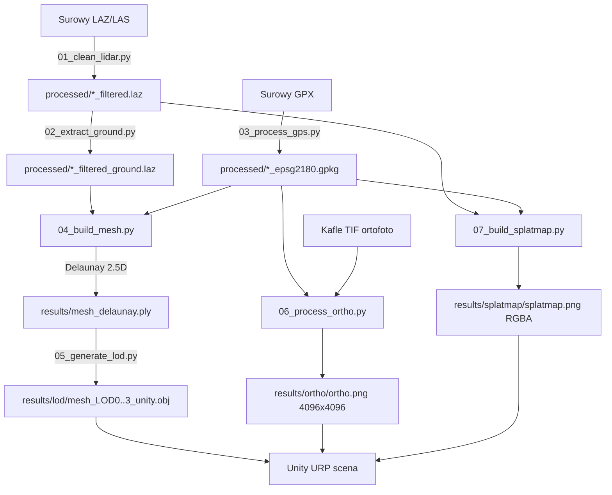

# Pipeline — opis krok po kroku

Dokument szczegolowo opisuje siedem etapow pipeline-u zaimplementowanego w `src/mtb_terrain/` oraz cienkich wrapperach w `scripts/0X_*.py`.

## Diagram przeplywu

## 01. Cleanup LiDAR — `01_clean_lidar.py`

**Modul:** `mtb_terrain.lidar.cleanup`
**Zalozenie:** surowy plik LAZ/LAS zawiera szumy pomiarowe (loty, ptaki, refleksy z wody) oraz punkty oznaczone klasa 7 (noise).

Filtry PDAL stosowane szeregowo:
1. **Statistical Outlier Removal (SOR)** — odrzuca punkty z gestoscia sasiedztwa odbiegajaca od sredniej o wiecej niz `multiplier * std`. Parametry domyslne: `mean_k=12`, `multiplier=2.2`.
2. **Radius Outlier Removal (ROR)** — odrzuca punkty z mniej niz `min_k` sasiadami w promieniu `radius`. Parametry domyslne: `radius=1.0 m`, `min_k=4`.
3. **Filtr klasy 7** — `filters.range "Classification![7:7]"`.

**Wyjscie:** `processed/<nazwa>_filtered.laz`.

## 02. Ekstrakcja ground — `02_extract_ground.py`

**Modul:** `mtb_terrain.lidar.extract_ground`
Filtruje chmure do punktow klasy 2 (ASPRS = ground) za pomoca `laspy`. Wynik to chmura "gola powierzchnia ziemi", uzywana pozniej do triangulacji.

**Wyjscie:** `processed/<nazwa>_filtered_ground.laz`.

> Alternatywnie modul `mtb_terrain.lidar.process` udostepnia pelny pipeline SMRF + DTM jako pojedynczy run — pozostawiony dla przypadkow, gdy plik wejsciowy nie jest jeszcze sklasyfikowany.

## 03. Przetworzenie GPS — `03_process_gps.py`

**Modul:** `mtb_terrain.gps.process`
1. Parsuje GPX przez `gpxpy`.
2. Transformuje wspolrzedne z WGS84 (EPSG:4326) do PL-1992 (EPSG:2180) — kluczowe, bo polskie dane LiDAR i ortofoto sa w 2180.
3. Liczy statystyki trasy: dlugosc, czas, D+/D-, rozklad nachylen.
4. Eksportuje:
   - `processed/<nazwa>_processed_2180.gpx` (GPX z dodatkowymi tagami x/y w EPSG:2180),
   - `processed/<nazwa>_epsg2180.gpkg` z warstwami `track_points`, `track_line`, `track_buffer`.

## 04. Integracja GPS + LiDAR + mesh — `04_build_mesh.py`

**Modul:** `mtb_terrain.mesh.delaunay`

Co robi:
1. Wczytuje chmure ground i slad GPS w EPSG:2180.
2. Opcjonalnie wygladza slad GPS metoda **Savitzky-Golay** (zachowuje feature edges lepiej niz Gauss).
3. Przycina chmure do bufora wokol sladu (`--buffer-distance` w metrach, domyslnie 30 m). Operacja **point-to-polyline**.
4. Dla kazdego punktu GPS znajduje najblizszy punkt LiDAR i bierze stamtad wysokosc Z (chunked nearest neighbor — oszczedza pamiec).
5. Triangulacja **Delaunay 2.5D** na plaszczyznie XY z odrzuceniem trojkatow o krawedziach dluzszych niz `max_edge_length` (eliminuje "rozciagniete" trojkaty na brzegu bufora).
6. Opcjonalnie **Poisson surface reconstruction** (Open3D, depth=9).
7. Eksport: `results/mesh_delaunay.ply` + `results/mesh_poisson.ply`.

Interaktywny podglad Open3D — klawisz `M` przelacza miedzy chmura/Delaunay/Poisson.

## 05. Cleanup + LOD — `05_generate_lod.py`

**Modul:** `mtb_terrain.mesh.pipeline`

Wieloetapowy cleanup mesh-a:
1. Usuniecie duplikatow wierzcholkow i trojkatow zdegenerowanych.
2. Filtr dlugich krawedzi (artefakty Delaunay na brzegach).
3. (opcjonalnie) Fill holes — wylaczone domyslnie, bo Open3D potrafi pomylic zewnetrzny brzeg z dziura.
4. **Taubin smoothing** (`lambda=0.5`, `mu=-0.53`) — wygladzanie bez skurczu.
5. Drugi pass filtra krawedzi — safety net po fill_holes/smoothing.
6. Orientacja trojkatow, normalne.

Generacja **kaskady LOD** przez Quadric Edge Collapse Decimation:
- LOD0 = 150 000 trojkatow (pierwszy plan, 0–80 m od kamery),
- LOD1 = 50 000 (80–250 m),
- LOD2 = 15 000 (250–800 m),
- LOD3 = 5 000 (>800 m, fallback culling).

Eksport w dwoch wariantach:
- `mesh_LOD<n>.{ply,obj}` — w oryginalnym CRS (do QGIS/CloudCompare),
- `mesh_LOD<n>_unity.{ply,obj}` — wycentrowany do origin (Unity uzywa float32; wspolrzedne EPSG:2180 ~5e5 gubia precyzje).

`pipeline_report.json` zawiera komplet statystyk: liczbe wierzcholkow/trojkatow, powierzchnie, manifold checks, slope statistics — gotowy material do tabeli w rozdziale eksperymentow.

## 06. Ortofoto — `06_process_ortho.py`

**Modul:** `mtb_terrain.ortho.pipeline`

1. Inspekcja kafli TIF (CRS, rozdzielczosc, zasieg).
2. Wyznaczenie bbox trasy z GPKG lub z `pipeline_report.json`.
3. Mozaika + crop przez `rasterio.merge` (`bounds=` ogranicza wczytywany fragment — oszczedza RAM).
4. Resize do potegi 2 (`output_size=4096` domyslnie — wymog `Texture2D` w Unity).
5. Eksport: `ortho.png` (RGB, sRGB ON), `ortho_preview.png`, `ortho_report.json` z metadanymi do UV mappingu.

## 07. Splatmap — `07_build_splatmap.py`

**Modul:** `mtb_terrain.splatmap.pipeline`

Generuje 4-kanalowa splatmape RGBA dla **Unity Terrain Layers**:
- **R = GROUND** — rasteryzacja gestosci ASPRS class 2,
- **G = PATH** — bufor wokol sladu GPS z **gaussian falloff** (sigma `path_falloff_m`),
- **B = UNDERGROWTH** — rasteryzacja klas wegetacji 3/4/5,
- **A = ROCK** — punkty ground z wysoka lokalna chropowatoscia Z (`std(Z) > rock_threshold`).

Po smoothingu kazdej warstwy splatmapa jest normalizowana per piksel (suma R+G+B+A = 1, wymog Unity). Path nadpisuje ground tam, gdzie GPS przechodzi — zeby sciezka byla widoczna nawet w gestych obszarach traw/lisci.

Eksport:
- `splatmap.png` (RGBA), `splatmap_preview.png` (RGB pseudo-realistyczny do weryfikacji),
- `layer_{0..3}_<nazwa>.png` (debug — kazda warstwa osobno),
- `splatmap_report.json` (statystyki pokrycia warstw).

## Decyzje projektowe

- **EPSG:2180** jako jedyny uklad docelowy — wszystkie polskie dane (LiDAR z GUGiK, ortofoto z geoportal.gov.pl) sa w tym ukladzie, unika sie wielokrotnej reprojekcji.
- **Unity-ready warianty mesh-a** — `_unity.obj` wycentrowane do origin. Unity uzywa `float32` w transformach i wspolrzedne ~5×10^5 (typowe dla EPSG:2180) traca precyzje powyzej 10^5.
- **Splatmap potega 2** — wymog Unity `Texture2D`. 1024 px to balans miedzy szczegolowoscia warstw a rozmiarem pliku.
- **PDAL przez conda-forge** — pip nie ma stabilnych kol dla wszystkich platform; `environment.yml` to glowny sposob instalacji.
